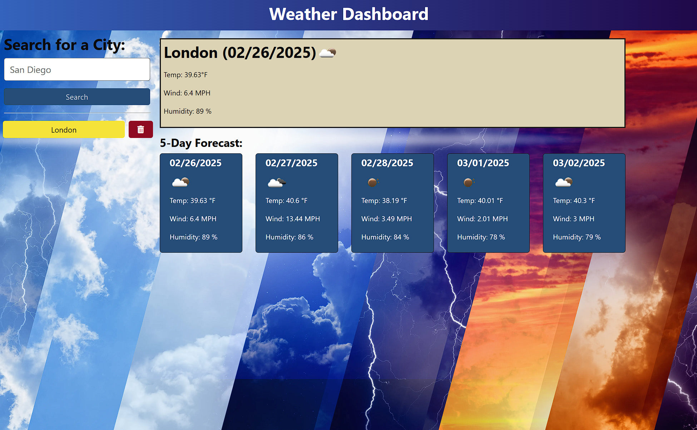

# Weather Dashboard - API Usage
  
## Description
  
The Weather Dashboard is a web application that provides users with real-time weather information along with a 5-day forecast for cities worldwide. Users can search for a city to retrieve data, including temperature, wind speed, and humidity. The application uses [Express](https://expressjs.com/) to communicate with the weather API and can be deployed in any environment. During creation, Render was used as the testing environment. The application is built with Node.js and utilizes the OpenWeather API for weather data.
  
## Features

* Real-time current weather data and the 5-Day Forecast.
* Search functionality by cities.
* Display of temperature, wind speed, and humidity. 
* Able to store a list of searched cities.

## Table of Contents

- [Description/Features](#description)
- [Installation](#installation)
- [Usage](#usage)
- [Deployment](#deployment)
- [Contributing](#contributing)
- [License](#license)
- [Media](#media)
    
## Installation
  
Before running the application, you need to install the necessary packages. Follow these steps:

     1. Ensure you have [Node.js](https://nodejs.org/) and npm installed.
     2. Clone the repository and navigate to the project directory.
     3. Install the dependencies using the command-line command:
  
   ```sh
   npm install
   ```

## Usage

To initialize the application:

1. You will need to set up an account OpenWeather API in order to get an APIKey to access the OpenWeather API. Be sure to update the environment variable in the `.env` file with your key.
2. Start the server with the command-line command:
  
   ```sh
   npm start
   ```
3. For development mode (run both the client and server) use the command-line command:
  
   ```sh
   npm run start:dev
   ```

## Deployment

Render was used for development during creation. You can access it at Live URL. However, the application is set up to run in any deployment environment. To deploy the application to Render, follow these steps:

1. Create a new web service on Render.
2. Connect your GitHub repository.
3. Set the environment variables, including your OpenWeather API key.
4. Deploy the application.

## Contributing

Contributions are welcome! You can submit a pull request or open an issue for any bugs or feature request.

## License

This project is licensed under the MIT license.


## Media

### Screenshot



### Video

[Watch the application in action](https://drive.google.com/file/d/1xnA_cLHrZ3BbK3Slm0bf_kjhU4KPCstX/view?usp=sharing)
```

