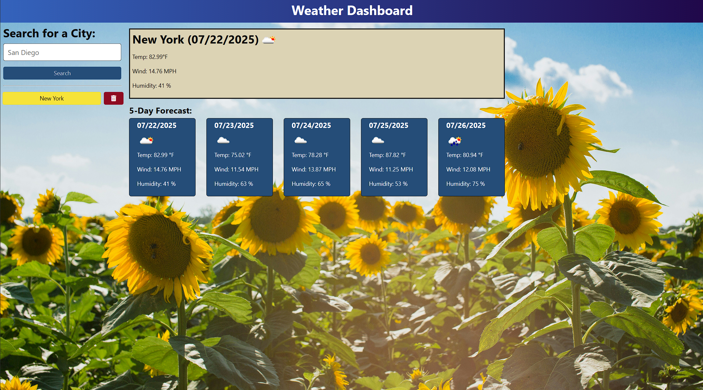

# Weather Dashboard 🌦️ - API Usage

_Effortlessly view real-time weather and forecasts for any city worldwide._

   

----

## 📚 Table of Contents

- [Weather Dashboard 🌦️ - API Usage](#weather-dashboard-️---api-usage)
  - [📚 Table of Contents](#-table-of-contents)
  - [📝 Description](#-description)
  - [✨ Features](#-features)
  - [🖼️ Media](#️-media)
  - [🧰 Technologies Used](#-technologies-used)
  - [⚙️ Prerequisites](#️-prerequisites)
  - [⚡ Quick Start](#-quick-start)
  - [📦 Installation](#-installation)
  - [💡 Usage](#-usage)
  - [🚀 Deployment](#-deployment)
  - [🙏 Credits](#-credits)
  - [📄 License](#-license)

----

## 📝 Description

_**The Weather Dashboard**_ is a web application that provides real-time weather data and a 5-day forecast for cities worldwide. Users can search for a city to view details such as temperature, wind speed, and humidity. The application is built with [Node.js](https://nodejs.org/en) and utilizes the [OpenWeather API](https://openweathermap.org/api) for weather data. It uses [Express](https://expressjs.com/) for API communication and was tested using [Render](https://render.com/), though it can be deployed in any environment.

----

## ✨ Features

- 🌦️ _**Live Weather Updates:**_ Instantly view current weather conditions for any city worldwide.
- 📅 _**5-Day Forecast:**_ Get details forecasts including temperature, wind speed, and humidity for the next five days.
- 🔍 _**Global Search:**_ Search for cities across the globe and receive accurate weather data.
- 🕒 _**Recent Searches:**_ Previously searched cities are saved for quick and easy access.
- 🔐 _**Secure API Integration:**_ Uses environment variables to keep your API key safe.
  
----

## 🖼️ Media

- **🖼️ Screenshot:**



----

## 🧰 Technologies Used

**Frontend:**

- ⚛️ [React](https://reactjs.org/)
- 🛣️ [React Router](https://reactrouter.com/)
- ⚡ [Vite](https://vitejs.dev/)
- 🟦 [TypeScript](https://www.typescriptlang.org/)

**Backend:**

- 🟩 [Node.js](https://nodejs.org/)
- 🚂 [Express.js](https://expressjs.com/)

----

## ⚙️ Prerequisites

- 🟩 [Node.js](https://nodejs.org/) (v18 or higher)
- 📦 [npm](https://www.npmjs.com/) (comes with Node.js)
- 🐙 A GitHub account (for cloning and contributing)

----

## ⚡ Quick Start

You can get the code by either cloning this repository using Git, or downloading it as a ZIP file from GitHub (click the green "Code" button, then "Download ZIP").
On GitHub, you can also browse the code, view commit history, open issues, and submit pull requests.

----

## 📦 Installation

1. **Clone the repository:**

```bash
    git clone https://github.com/your-username/project-buddy.git
    cd project-buddy
```

 2. **Install dependencies for both client and server:**

```bash
    npm run install
```

  > **Note:** Alternatively, you can install them separately:

```bash
    # First
    cd client
    npm install

    # Second
    cd server
    npm install
```

----

## 💡 Usage

To initialize the application:

1. Create an account at [OpenWeather API](https://openweathermap.org/api) to receive an ```APIKey```🔑 to access the OpenWeather API server.

2. Create a 🔐 `.env` file in the server directory.

> **Note:** Never commit your real 🔐`.env` file to version control. Only commit `.env.example` with placeholder values.

```env
  API_KEY=your_open_weather_api_key
  API_BASE_URL=https://api.openweathermap.org
  PORT=your_open_port
```

3. Start the application with in the command-line command:

```bash
    npm start
```

4. For development mode (Optional to run both the client and server) use:

```bash
    npm run start:dev
```

----

## 🚀 Deployment

The application was tested on Render, but it can be deployed in any environment. To deploy on Render, follow these steps:

1. Create a new web service on [Render](https://render.com/).

2. Connect your GitHub repository.

3. Set up environment variables, including your OpenWeather ```API key.```

4. Click ```Deploy```

5. Once deployed, access your app at the provided Render URL.

----

## 🙏 Credits

- [OpenWeather API](https://openweathermap.org/api) for having open API  

----

## 📄 License

This project is licensed under the MIT license.


