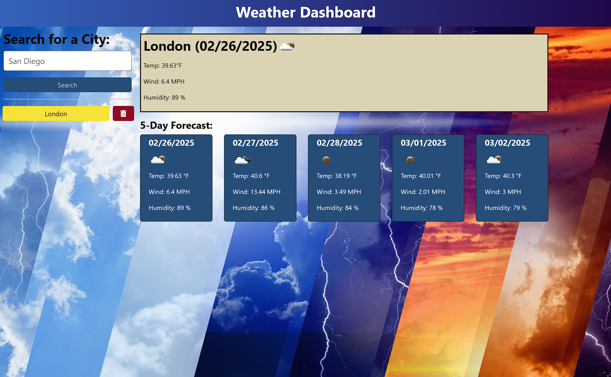

# Weather Dashboard

_A full-stack weather dashboard app with search history, real-time weather, and a 5-day forecast using the OpenWeather API._


**Live Demo:** [Weather Dashboard on Render](https://weather-api-mod-9.onrender.com)

---

## Table of Contents

- [Weather Dashboard](#weather-dashboard)
  - [Table of Contents](#table-of-contents)
  - [Description](#description)
  - [Features](#features)
  - [Prerequisites](#prerequisites)
  - [Technologies Used](#technologies-used)
  - [Installation](#installation)
  - [Usage](#usage)
  - [API Documentation](#api-documentation)
  - [License](#license)
  - [Media](#media)
    - [Screenshot](#screenshot)
    - [Video](#video)
  - [Contributing, Support, and FAQ](#contributing-support-and-faq)
  - [Acknowledgments](#acknowledgments)
  - [Author](#author)

---

## Description

The Weather Dashboard is a web application that provides real-time weather data and a 5-day forecast for cities worldwide. Users can search for a city to view details such as temperature, wind speed, and humidity. The app stores previously searched cities for quick access and is built with Node.js, Express, TypeScript, and Vite. Weather data is fetched from the [OpenWeather API](https://openweathermap.org/api).

---

## Features

* Real-time current weather data and 5-day forecast
* Search for any global city
* Displays temperature, wind speed, and humidity
* Search history with ability to delete entries
* Responsive design for desktop and mobile

---

## Prerequisites

* [Node.js](https://nodejs.org/) (v18 or higher)
* [npm](https://www.npmjs.com/) (comes with Node.js)
* An [OpenWeather API key](https://openweathermap.org/api)

---

## Technologies Used

**Frontend:**
- [Vite](https://vitejs.dev/)
- [TypeScript](https://www.typescriptlang.org/)
- [Bootstrap](https://getbootstrap.com/)
- [FontAwesome](https://fontawesome.com/)

**Backend:**
- [Node.js](https://nodejs.org/)
- [Express.js](https://expressjs.com/)
- [TypeScript](https://www.typescriptlang.org/)
- [dotenv](https://github.com/motdotla/dotenv)

---

## Installation

1. **Clone the repository:**

    ```bash
    git clone https://github.com/your-username/weather-dashboard-api-usage.git
    cd weather-dashboard-api-usage
    ```

2. **Install dependencies for both client and server:**

    ```bash
    npm run install
    ```

    Or install separately:

    ```bash
    cd client
    npm install
    cd ../server
    npm install
    ```

3. **Set up environment variables:**

    Create a `.env` file in the `server` directory:

    ```env
    API_KEY=your_openweather_api_key
    API_BASE_URL=https://api.openweathermap.org/data/2.5
    PORT=3001
    ```

    > **Note:** Never commit your real `.env` file to version control.

4. **Build the frontend:**

    ```bash
    cd client
    npm run build
    cd ..
    ```

5. **Start the server(s):**

    - **For development:**

        ```bash
        npm run start:dev
        ```

        This runs both the backend and frontend in development mode.

    - **For production:**

        ```bash
        npm start
        ```

        This serves the built frontend from the backend.

---

## Usage

1. **Obtain an OpenWeather API key** from [OpenWeather](https://openweathermap.org/api).
2. **Add your API key** to the `.env` file in the `server` directory.
3. **Start the application** as described above.
4. **Open your browser** and visit [http://localhost:3000](http://localhost:3000).
5. **Search for a city** to view current weather and forecast.
6. **Click on a city in the search history** to quickly view its weather again.
7. **Delete a city from history** using the trash icon.

---

## API Documentation

See [`API.md`](./API.md) for complete API endpoint documentation.

---

## License

This project is licensed under the [MIT License](./LICENSE.txt).

See the [MIT License text](https://opensource.org/licenses/MIT) for full details.

---

## Media

### Screenshot



### Video

[Watch the application in action](https://drive.google.com/file/d/1xnA_cLHrZ3BbK3Slm0bf_kjhU4KPCstX/view?usp=sharing)

---

## Contributing, Support, and FAQ

- **Contributions:** Pull requests are welcome! Please open an issue or submit a pull request for improvements or bug fixes.
- **Support:** If you encounter any issues or have suggestions, please open an issue on GitHub.
- **FAQ:**
    - _How do I run the program?_
      See the [Installation](#installation) and [Usage](#usage) sections above.
    - _Can I use this for my own project?_
      Yes, this project is MIT licensed. See the [License](#license) section.

---

## Acknowledgments

Portions of this project were developed using starter code provided by [edX Boot Camps LLC](https://bootcamp.edx.org/) for educational purposes.

---

## Author

Created by Sharon Heim.
For questions or suggestions, please visit my [GitHub profile](https://github.com/heimsharon).

---

© 2025 Weather Dashboard Project


